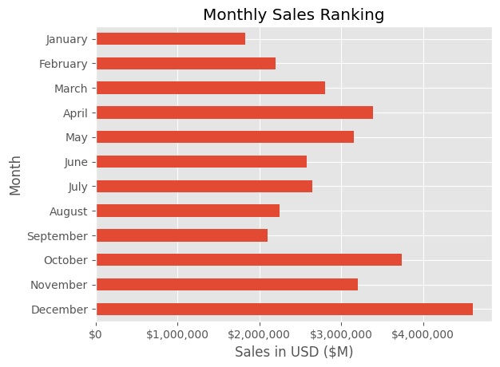
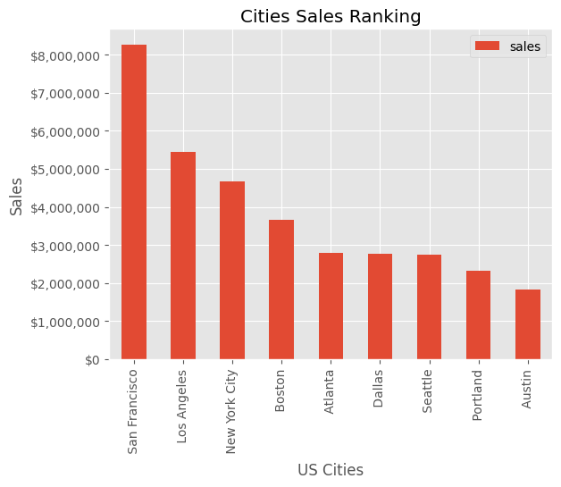
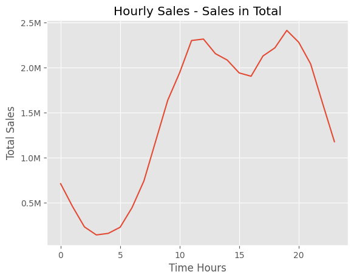
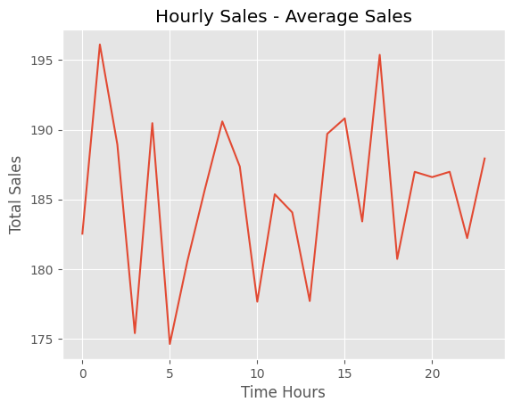
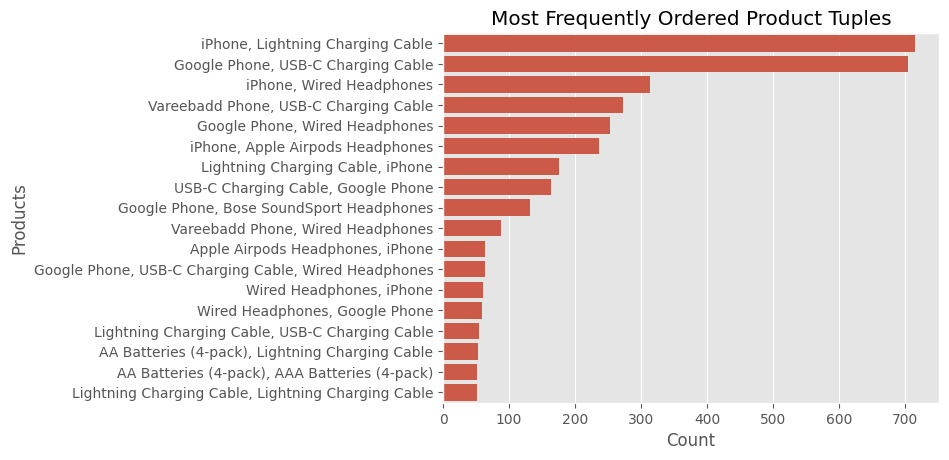

# Sales Data Analysis

A Python-based project analyzing sales data to extract meaningful insights, such as identifying the best month for sales, top-performing cities, optimal advertisement timing, and products often sold together.

---

## Questions Solved:
1. **What was the best month for sales?**  

2. **What city had the highest number of sales?**  

3. **What time should we display advertisements to maximize the likelihood of customers buying products?**  

4. **What products are most often sold together?**  

---

## Dataset
- The dataset contains sales records including **order ID, product, quantity ordered, price, order date, purchase address, etc.**
- Data preprocessing includes:
  - Handling missing values
  - Parsing dates
  - Extracting useful features (e.g., month, city, purchase hour)
  - Identifying product combinations

---

### Credits

- **Dataset and Questions:** Provided by [Keith Galli](https://www.youtube.com/watch?v=eMOA1pPVUc4&t=4721s)  
- **Solutions:** Implemented by me